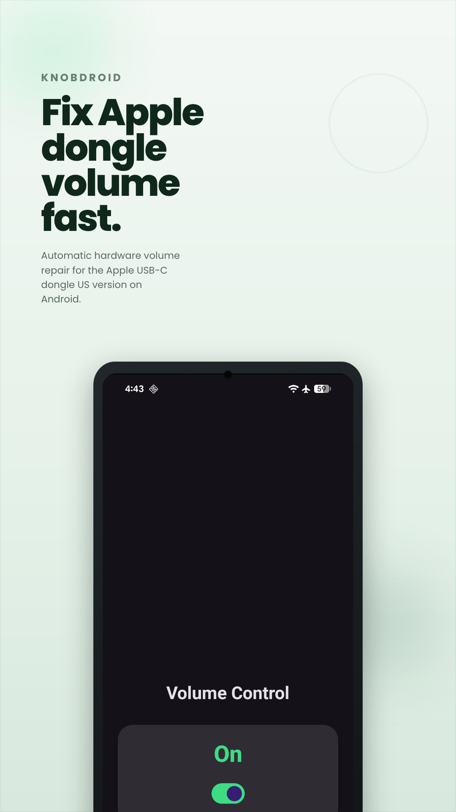
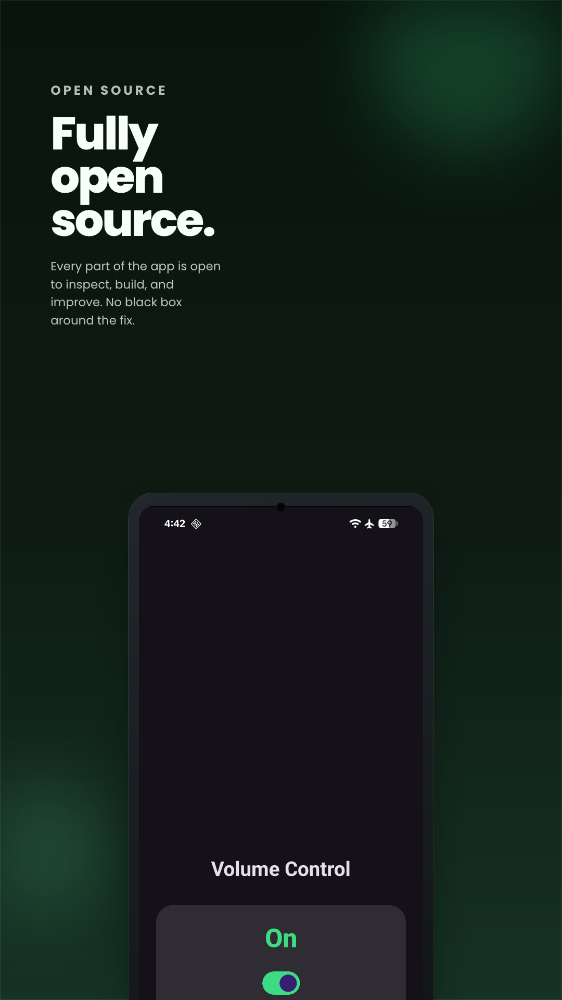
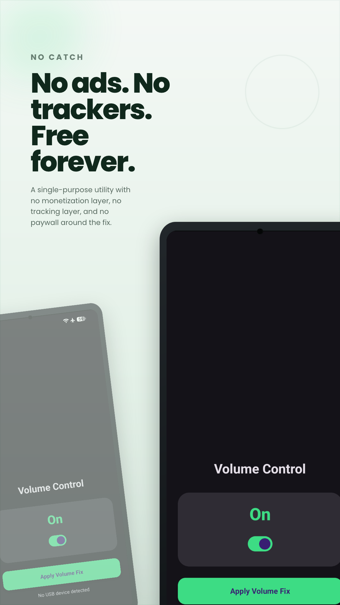

<h1 align="center">KnobDroid</h1>
<p align="center">
  <b>Fixes low volume on the Apple USB-C dongle on Android</b>
</p>

<p align="center">
  <a href="https://github.com/100nandoo/KnobDroid/releases/latest">
    
  </a>
  <a href="LICENSE">
    
  </a>
  <a href="https://github.com/100nandoo/KnobDroid/releases">
    
  </a>
</p>

<p align="center">
  <a href="#download"><b>Download</b></a> &bull;
  <a href="#what-it-does"><b>What it does</b></a> &bull;
  <a href="#screenshots"><b>Screenshots</b></a> &bull;
  <a href="#setup"><b>Setup</b></a>
</p>

KnobDroid is a small Android app for one specific problem: the Apple USB-C to 3.5 mm headphone adapter can sound much quieter on Android than it should. This app listens for the dongle, asks for USB access, and sends the hardware command needed to apply the volume fix automatically.

I built it for the US version of the Apple dongle, but it may also work with other UAC2 DACs that respond to the same command.

> [!IMPORTANT]
> Once setup is done, the fix runs automatically when the dongle is connected. You do not need to open the app every time.

## Screenshots

<details>
  <summary>expand</summary>
  <br>

 | 

</details>

## Download

<p align="center">
  <table align="center">
    <tr>
      <td align="center"><b>Stable release</b></td>
    </tr>
    <tr>
      <td align="center">
        <a href="https://github.com/100nandoo/KnobDroid/releases/latest">
          
        </a>
      </td>
    </tr>
  </table>
</p>

## What it does

On some Android phones, the Apple USB-C dongle starts with a low hardware volume level. Android audio controls alone do not always fix that, because the problem is inside the DAC.

KnobDroid watches for the device and, when it appears, it:

1. Detects the dongle.
2. Requests the USB permission it needs.
3. Sends the UAC2 hardware command.
4. Finishes quietly in the background.

## Features

- Automatically runs when the supported device is attached
- Sends a simple hardware on or off command without extra setup
- Stays out of the way after the command is applied
- Built with Jetpack Compose
- Focused on the US Apple USB-C to 3.5 mm headphone adapter

## Setup

1. Open the app once and choose whether the hardware command should be on or off.
2. Approve the USB and audio permission prompts. If Android asks, choose "Always open KnobDroid" so it can handle the dongle automatically.
3. Plug in the DAC. A toast confirms when the command has been applied.

## Building from source

```bash
git clone https://github.com/100nandoo/KnobDroid.git
```

1. Open the project in Android Studio 2024.1.1 or newer.
2. Install the NDK and CMake from the SDK Manager.
3. Build and run it on your device.

## Requirements

- Android 9.0 (API 28) or higher
- A UAC2-compliant USB DAC, such as the Apple USB-C to 3.5 mm adapter

## Tech stack

- Kotlin
- Jetpack Compose
- C++ and JNI for direct USB communication

## Credits

This project builds on earlier work from [ibaiGorordo/libusbAndroidTest](https://github.com/ibaiGorordo/libusbAndroidTest) and [polhdez/usbDacVolumeAndroid](https://github.com/polhdez/usbDacVolumeAndroid).

## License

KnobDroid is open source under the GNU General Public License v3.0.

---

Copyright (c) 2026 100nandoo
