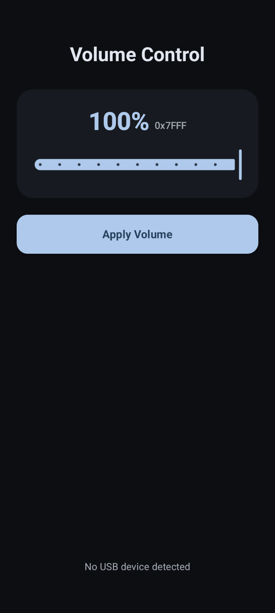
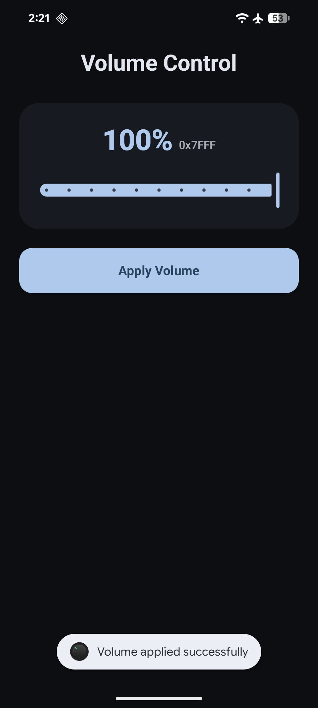

# KnobDroid 🎛️

<p align="center">
  <a href="https://github.com/100nandoo/KnobDroid/releases/latest">
    
  </a>
  <a href="LICENSE">
    
  </a>
  <a href="https://github.com/100nandoo/KnobDroid/releases">
    
  </a>
</p>

**KnobDroid** is a specialized Android utility designed to automatically set the hardware volume of USB Audio Class 2 (UAC2) DACs, specifically the **Apple USB-C to 3.5mm Headphone Jack Adapter**, to a preferred level whenever they are connected.

> [!IMPORTANT]
> **Automatic Trigger** - The hardware volume is automatically applied as soon as an Apple USB-C Dongle is detected, ensuring your audio is always at the perfect level without any manual intervention.

## 📥 Download

<p align="center">
  <table align="center">
    <tr>
      <td align="center"><b>Stable Release</b></td>
    </tr>
    <tr>
      <td align="center">
        <a href="https://github.com/100nandoo/KnobDroid/releases/latest">
          
        </a>
      </td>
    </tr>
  </table>
</p>

## 🚀 The Problem
When using the Apple USB-C dongle on Android devices, users often experience significantly lower volume compared to other platforms. This is because Android doesn't always correctly initialize the DAC's internal hardware volume mixer, often defaulting it to a low value.

## ✨ The Solution
KnobDroid listens for USB connection events. When an Apple DAC (or other compatible UAC2 devices) is plugged in, it automatically:
1. Detects the device.
2. Requests necessary USB permissions.
3. Sets the hardware volume to your desired level (defaulting to 100%) via the UAC2 protocol.
4. Operates silently in the background, so you don't have to manually open the app every time.

## 🛠 Features
- **Automatic Trigger**: Automatically executes volume correction upon device attachment.
- **Silent Mode**: Lightweight activity handles volume adjustment without cluttering your screen.
- **Customizable Volume**: Simple UI to set your preferred default volume.
- **Modern UI**: Built with Jetpack Compose for a sleek, responsive experience.
- **Broad Compatibility**: Works with Apple USB-C DACs and other UAC2-compliant audio devices.

## 📸 Screenshots

| Not Detected | Apple Dongle Detected | Volume Applied |
| :---: | :---: | :---: |
|  |  |  |

## 🚀 Setup
1. **Initial Configuration**: Open the app and set your preferred hardware volume (100% recommended).
2. **Grant Permissions**: Approve the USB and Audio permission requests. Select **"Always open KnobDroid"** to enable automatic background processing.
3. **Connect**: Plug in your DAC. A toast notification will confirm when the volume is successfully applied.

## 🛠️ Building from Source
```bash
git clone https://github.com/100nandoo/KnobDroid.git
```
1. Open the project in **Android Studio** (2024.1.1+).
2. Ensure **NDK** and **CMake** are installed via the SDK Manager.
3. Build and deploy to your device.

## 📋 Requirements
- Android 9.0 (API 28) or higher
- A UAC2-compliant USB DAC (e.g., Apple USB-C to 3.5mm Adapter)

## 🛠️ Tech Stack
- **Language**: Kotlin
- **UI**: Jetpack Compose
- **Native**: C++ (JNI) for direct USB hardware communication

## 📜 License
KnobDroid is open-source software licensed under the **GNU General Public License v3.0**.

---
Copyright (c) 2026 100nandoo
